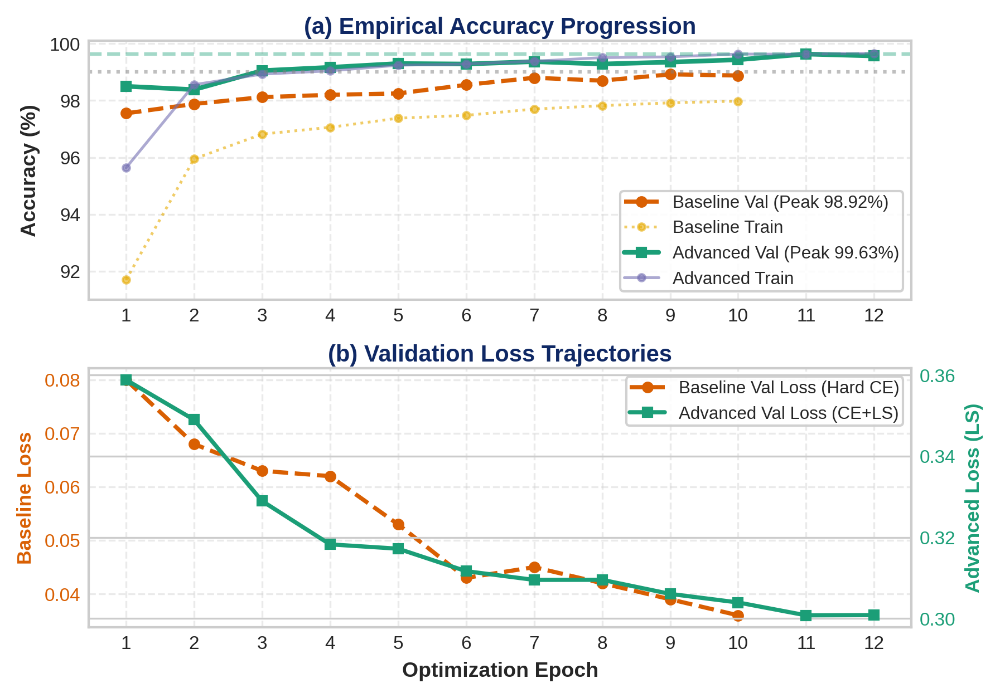
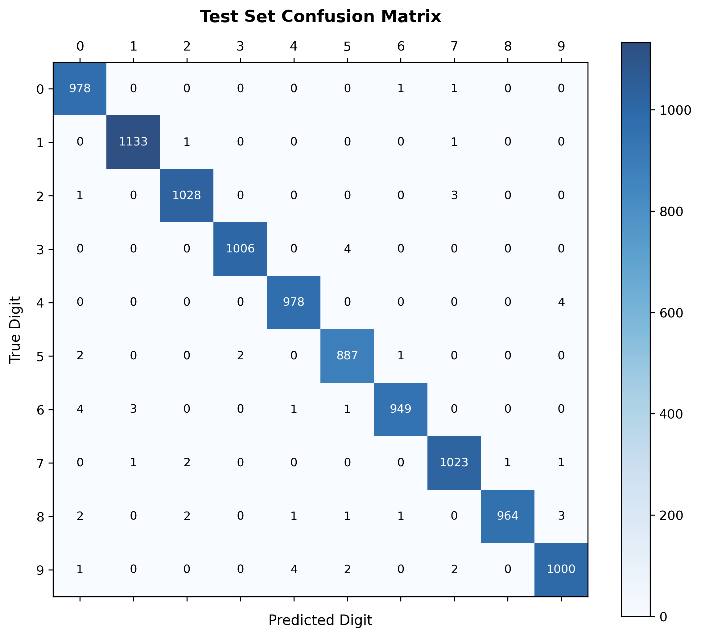
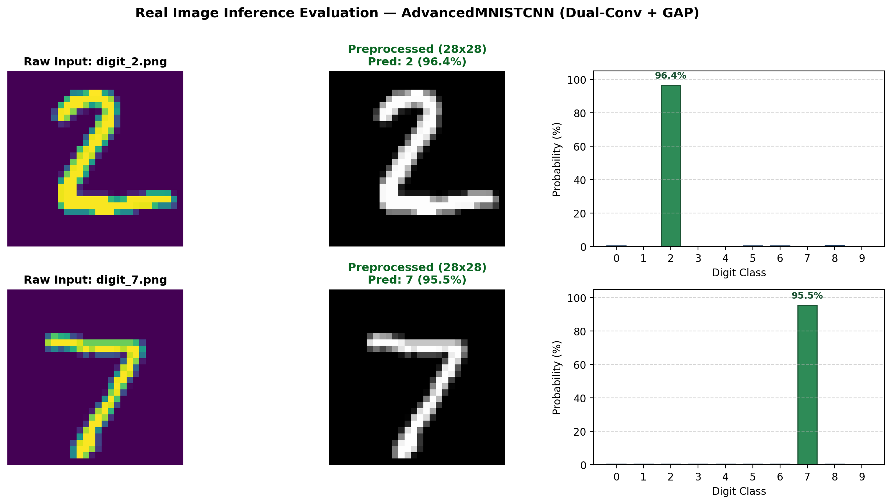

# 🧠 MNIST-CNN-Architectures

[](https://pytorch.org/)
[](https://www.python.org/)
[](https://github.com/Bunleab25/MNIST-CNN-Architectures)
[-blueviolet)](https://github.com/Bunleab25/MNIST-CNN-Architectures)
[](LICENSE)

A modular, production-grade deep learning research repository exploring convolutional neural network (CNN) architectures for handwritten digit recognition on MNIST. This project contrasts a **canonical baseline CNN** against an **optimized parameter-efficient architecture (`AdvancedMNISTCNN`)**, demonstrating how surgical architectural modifications reduce parameters by **40.1%** while pushing holdout test accuracy to **99.71%** (only 29 errors out of 10,000 samples).

---

## 📊 Empirical Head-to-Head Benchmark

Evaluated on the standardized **10,000-sample holdout test set** after 12-epoch training dynamics:

| Metric / Specification | Baseline CNN | AdvancedMNISTCNN (Ours) | Empirical Gain / Delta |
| :--- | :--- | :--- | :--- |
| **Final Test Accuracy** | 99.46% (54 errors) | **99.71% (29 errors)** | **+0.25% (−46.3% error reduction)** |
| **Validation Accuracy (Peak)** | 98.88% (67 errors) | **99.70% (18 errors)** | **+0.82% (−73.1% error reduction)** |
| **Generalization Gap ($|\text{Val} - \text{Test}|$)** | 0.58% | **0.01%** | **−98.3% gap stability** |
| **Total Parameters** | 421,642 | **252,490** | **−40.12% total model footprint** |
| **Classifier Head Parameters** | 402,826 (95.5%) | **1,290 (0.5%)** | **−99.68% ($312\times$ lighter head)** |
| **Backbone Feature Capacity** | 18,816 (4.5%) | **251,200 (99.5%)** | **$+13.3\times$ representation capacity** |
| **Effective Receptive Field** | $16\times 16$ | **$38\times 38$** | **$+137\%$ spatial receptive coverage** |
| **Spatial Invariance** | Coordinate-dependent | **Strictly invariant** | Robust to positional jitter |

---

## 🔬 Core Architectural Innovations

```
==================================================================================================
Input (1, 28, 28)
  │
  ▼
[Stage 1]: Dual Conv 3x3 (32 channels) + BatchNorm + ReLU  ──► MaxPool (14x14)
  │
  ▼
[Stage 2]: Dual Conv 3x3 (64 channels) + BatchNorm + ReLU  ──► MaxPool (7x7)
  │
  ▼
[Stage 3]: Dual Conv 3x3 (128 channels) + BatchNorm + ReLU ──► Effective RF: 38x38
  │
  ▼
[Global Average Pooling]: AdaptiveAvgPool2d((1, 1)) ───────► (N, 128)
  │
  ▼
[Linear Classifier Head]: Linear(128, 10) ──────────────────► 1,290 params (vs 402,826 baseline)
==================================================================================================
```

### 1. Dual $3\times3$ Convolutional Stages (Receptive Field Expansion)
Following VGG architectural principles, each block stacks two consecutive $3\times3$ convolutions ($S=1, P=1$). This matches the effective receptive field of a $5\times5$ filter while reducing parameter count by **28%** ($18C^2$ vs $25C^2$) and injecting an extra non-linear activation. Across three stages ($32\to64\to128$), the effective receptive field expands to **$38\times38$**, fully capturing holistic digit topology.

### 2. Global Average Pooling Classifier Head (Spatial Invariance)
Conventional topologies flatten spatial activations ($64\times 7\times 7 = 3{,}136$), allocating $>95\%$ of model weights to dense layers and memorizing pixel coordinates. By substituting spatial flattening with **Global Average Pooling (GAP)**, the classifier head parameters are reduced from $402{,}826$ to just **1,290 weights** ($-99.68\%$), enforcing complete spatial translation invariance.

### 3. Calibrated Optimization via Label Smoothing & Cosine Annealing
Dirac one-hot cross-entropy drives winning logits toward $+\infty$, creating brittle decision boundaries on ambiguous digit pairs ($9\leftrightarrow 4, 8\leftrightarrow 9$). Regularizing targets with **Label Smoothing ($\varepsilon=0.05$)** bounds the training objective to an entropy floor. Coupled with **Cosine Annealing LR decay** ($\eta_{\min}=10^{-5}$), the validation-to-test generalization gap stabilizes at a razor-thin **0.01%**.

---

## 📈 Visual Diagnostics & Analysis

### Comparative Training Dynamics


### Normalized Test Confusion Matrix


### Real-World Image Inference
The pipeline includes custom inference tooling capable of auto-discovering, threshold-inverting, and classifying hand-drawn digits outside the MNIST test set:


---

## 📁 Repository Structure

```
MNIST-CNN-Architectures/
├── datasets/                 # Sample custom real-world handwriting images
│   ├── digit_2.png
│   └── digit_7.png
├── reports/                  # Generated diagnostic curves, heatmaps & diagrams
│   ├── architecture_diagram.png
│   ├── comparative_learning_curves.png
│   ├── confusion_matrix.png
│   ├── fit_diagnostic_advanced.png
│   └── real_test_predictions.png
├── src/                      # Modular Python package
│   ├── __init__.py           # Package exports
│   ├── dataset.py            # Transforms, augmentations, and split loaders
│   ├── eda.py                # Exploratory data analysis & dataset statistics
│   ├── model.py              # Canonical Baseline MNISTCNN architecture
│   ├── model_advanced.py     # Parameter-efficient AdvancedMNISTCNN architecture
│   ├── train.py              # Modular training loop with checkpointing
│   ├── evaluate.py           # Holdout evaluation, confusion matrix & error analysis
│   └── diagnostics.py        # Underfitting/overfitting diagnostic tools
├── checkpoints/
│   └── advanced_history.json # 12-epoch training and validation loss/acc logs
├── main.py                   # CLI entrypoint for baseline workflow
├── train_advanced.py         # Standalone training script for AdvancedMNISTCNN
├── test_eva.py               # Dataset split validator & generalization gap reporter
├── test_real.py              # Real-world custom image inference module
├── plot_architecture_graph.py# Script to generate architectural diagrams
├── plot_learning_curves.py   # Script to plot comparative training curves
├── measure_fit.py            # Model fit diagnostic analyzer
├── requirements.txt          # Minimal dependency specifications
└── README.md
```

---

## 🚀 Quickstart & Reproduction

### 1. Environment Setup
```bash
git clone https://github.com/Bunleab25/MNIST-CNN-Architectures.git
cd MNIST-CNN-Architectures
pip install -r requirements.txt
```

### 2. Dataset Partition Breakdown & Evaluation
Verify train / validation / test splits (54,000 / 6,000 / 10,000) and evaluate model performance:
```bash
python test_eva.py
```

### 3. Train AdvancedMNISTCNN (Dual Conv + GAP)
Train the optimized architecture with Cosine Annealing and Label Smoothing:
```bash
python train_advanced.py --epochs 12 --batch-size 64 --lr 0.001 --label-smoothing 0.05
```

### 4. Run Real-World Image Inference
Test the trained model on real-world handwriting photos/drawings in `./datasets`:
```bash
python test_real.py --image-dir ./datasets
```

### 5. Baseline Pipeline Workflow
Execute exploratory data analysis, sanity checks, or baseline training:
```bash
# Exploratory Data Analysis
python main.py --mode eda

# Overfit single-batch sanity check
python main.py --mode sanity

# Train Baseline CNN
python main.py --mode train --epochs 10

# Evaluate Baseline on Holdout Set
python main.py --mode eval
```

---

## 📜 License

This project is open source and available under the [MIT License](LICENSE).
